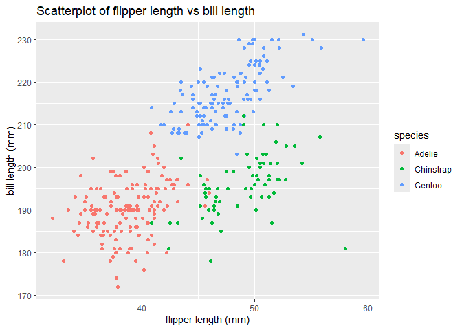

p8105_hw1_lz3014
================
Liqi Zhou
2024-09-20

``` r
library(palmerpenguins)
library(tidyverse)
```

    ## ── Attaching core tidyverse packages ──────────────────────── tidyverse 2.0.0 ──
    ## ✔ dplyr     1.1.4     ✔ readr     2.1.5
    ## ✔ forcats   1.0.0     ✔ stringr   1.5.1
    ## ✔ ggplot2   3.5.1     ✔ tibble    3.2.1
    ## ✔ lubridate 1.9.3     ✔ tidyr     1.3.1
    ## ✔ purrr     1.0.2     
    ## ── Conflicts ────────────────────────────────────────── tidyverse_conflicts() ──
    ## ✖ dplyr::filter() masks stats::filter()
    ## ✖ dplyr::lag()    masks stats::lag()
    ## ℹ Use the conflicted package (<http://conflicted.r-lib.org/>) to force all conflicts to become errors

# Problem 1

#### 1. load and view the `penguins` dataset:

``` r
data("penguins", package = "palmerpenguins")
```

#### 2. description of the `penguins` dataset

- **names of variables:** species, island, bill_length_mm,
  bill_depth_mm, flipper_length_mm, body_mass_g, sex, year  
- **size of tibble:** this tibble has 344 rows and 8 columns  
- **mean flipper length:** 200.9152047 mm

#### 3. draw and save scatterplot of flipper_length_mm vs bill_length_mm, colored by species

``` r
penguins |>
  drop_na(bill_length_mm, flipper_length_mm) |>
  ggplot(aes(x = bill_length_mm, 
             y = flipper_length_mm, 
             color = species)) + 
  geom_point() + 
  labs(title = "Scatterplot of flipper length vs bill length", 
       x = "flipper length (mm)", 
       y = "bill length (mm)")
```

<!-- -->

``` r
ggsave("Scatterplot of flipper length vs bill length.png")
```

    ## Saving 7 x 5 in image

# Problem 2

#### 1. create a data frame (seed:0920):

``` r
data_p2 <- tibble(
  vec_num = rnorm(10),
  vec_logi = vec_num > 0,
  vec_char = c("a","b","c","d","e","f","g","h","i","j"),
  vec_factor = factor(rep(c("level_1","level_2","level_3"), length.out = 10))
)
data_p2
```

    ## # A tibble: 10 × 4
    ##     vec_num vec_logi vec_char vec_factor
    ##       <dbl> <lgl>    <chr>    <fct>     
    ##  1  1.09    TRUE     a        level_1   
    ##  2 -1.35    FALSE    b        level_2   
    ##  3 -0.698   FALSE    c        level_3   
    ##  4 -0.568   FALSE    d        level_1   
    ##  5 -0.884   FALSE    e        level_2   
    ##  6  0.690   TRUE     f        level_3   
    ##  7  0.208   TRUE     g        level_1   
    ##  8 -1.14    FALSE    h        level_2   
    ##  9  0.535   TRUE     i        level_3   
    ## 10 -0.00737 FALSE    j        level_1
